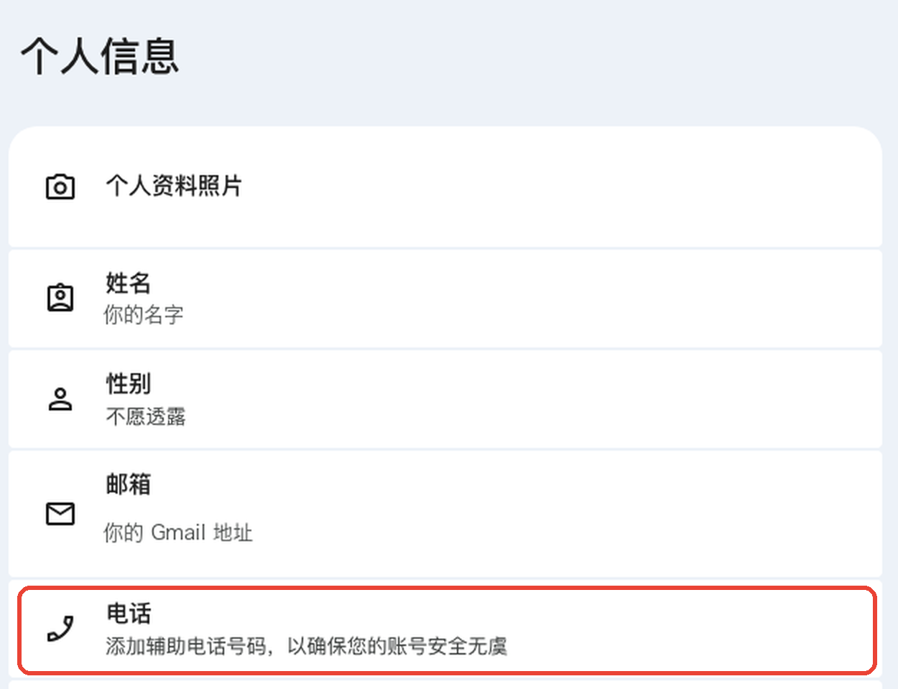
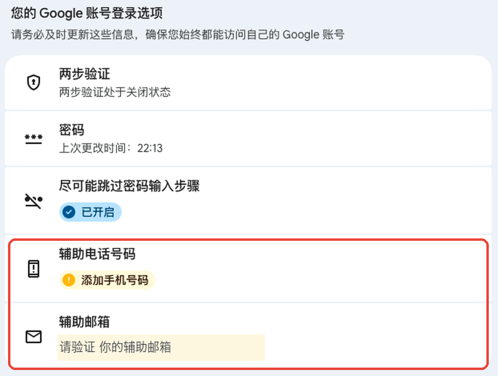
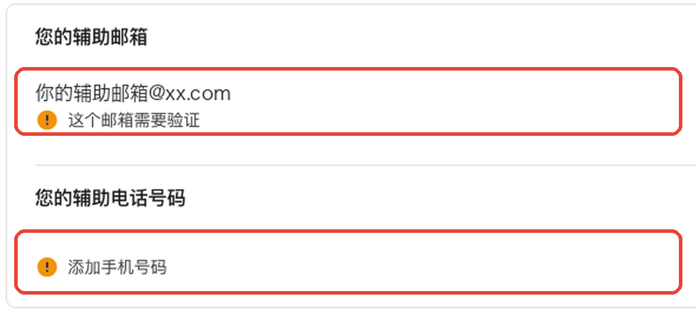
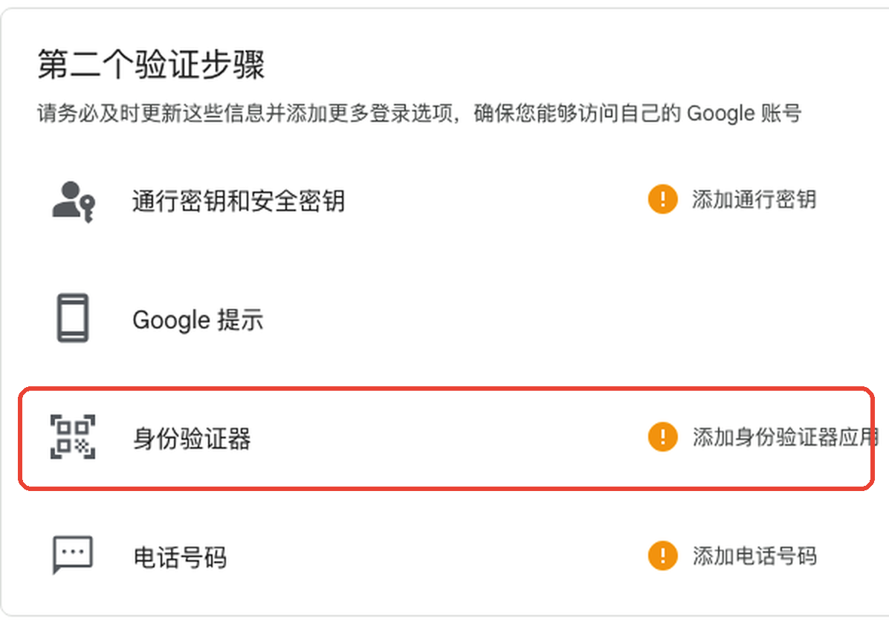

注册 Gmail 填完名字、生日、密码，到验证手机号这一步，填上自己的 +86 号码，Google 直接提示「**此电话号码无法用于验证**」（英文界面是 *This phone number cannot be used for verification*）。换个时间再试还是一样，注册就卡在这里。

这篇讲三件事：Google 官方怎么解释这个提示、实际能用的几种办法，以及大家最担心的问题——用别人的号码（或者临时号码）验证完，这个号会不会留在自己账号上。最后一点我们自己注册了一个账号实测，附截图。

## 一、为什么会提示「此电话号码无法用于验证」

Google 帮助中心《[验证您的账号](https://support.google.com/accounts/answer/114129)》给的解释很直接：**为了防止滥用，Google 限制了一个手机号能用来创建的账号数量**，看到这个提示就说明这个号码已经用到上限，官方建议换一个号码（比如家人朋友的，或者其他运营商的号）。

结合国内用户的实际情况，常见的触发原因有这几类：

- **号码用过太多次**：自己以前用这个号注册过好几个 Google 账号，或者是二次放号的手机号，上一位机主用过。
- **号段和网络环境被风控**：Google 不公开具体规则，但国内号码配合代理网络注册新账号，被拦下的比例明显偏高。
- **号码格式不对**：国家代码选错、号码多填或少填一位。先排除这一种，最省事。
- **虚拟号或网络电话号码**：很多平台对 VoIP 号码（如 Google Voice）有限制，用这类号码验证经常失败。

要注意的是，这个提示**不是你的手机或网络坏了**，在原页面上对同一个号码反复重试也没有用，反而可能让这个号被风控得更久。

## 二、有哪些解决办法

| 办法 | 怎么做 | 适合谁 |
|---|---|---|
| 换一个国内号码 | 用家人或其他运营商的号，按官方建议换号重试 | 身边有没用过 Google 注册的号码 |
| 换注册入口 | 在手机系统设置里「添加账号」，或从 YouTube、Gmail App 里新建账号；有用户反馈这样手机号会变成可选项，但不保证每次都行 | 想先免费试试的人 |
| 用海外手机号验证 | 用一个能收短信的美国号完成这一次验证 | 国内号试过不行、想一次过的人 |

先检查号码格式，再换国内号码或换注册入口，这两步免费，值得先试。都不行的话，最稳的是用一个海外号码收这一次验证码。

如果你只需要过这一次验证，可以用我们的[美国号收 Google 验证码](https://yotradeapi.com/sms/google?utm_source=blog&utm_medium=inline&utm_content=cn-gmail-phone-cannot-be-used-verify)：¥39.90 一次，微信付款，付款后等你走到填手机号那一步再取号，验证码自动显示在页面上；Google 提示号码不能用可以免费换号，换号后仍收不到全额退款。能不能通过 Google 的风控由 Google 决定，这一点任何号码都一样。页面上也有完整的图文步骤。

## 三、实测：用美国号注册后，号码会不会留在账号上？

这是很多人不敢用临时号码的原因：号码以后会回收给别人，万一它绑在我的账号上，别人拿到这个号会不会登进来？

我们 2026 年 10 月用美国号实际注册了一个 Gmail。注册成功后打开「Google 账号 → 个人信息」，**「电话」一栏是空的**，只提示「添加辅助电话号码」：

再看「安全 → 您的 Google 账号登录选项」，「辅助电话号码」同样是空的：

也就是说，**注册时验证用的号码只用于这一次验证，没有被设成账号的辅助电话**。号码回收后，拿到这个号的人没法用它找回或登录你的账号。

> 这个结论来自我们这一次实测。Google 的做法以后可能调整，注册完顺手看一眼「个人信息 → 电话」，如果那里有这个号，点进去删掉就行。

## 四、注册成功后，一定要做的 3 件事

注册时没留号码，好处是安全；但也意味着以后换手机、换电脑登录时，Google 要验证身份，就得靠别的方式。下面三步现在做好，以后就不用再找人收码。

**1. 验证辅助邮箱**：Google 账号 → 安全 → 辅助邮箱，填一个你常用的邮箱（QQ、163 都可以）并点验证。

**2. 添加自己的手机号**：同一页的「辅助电话号码」，填你自己的国内手机号。注册时被拒的号码，也可以在这里试着添加，能否添加以页面提示为准；加不上也没关系，第 1、3 步做好同样能保住账号。

**3. 开两步验证，第二步选身份验证器**：安全 → 两步验证 → 开启，推荐添加「身份验证器」（Google Authenticator 等 App）。它不依赖短信，在国内用起来比短信验证码稳定。

关于两步验证和找回的更多细节，可以看《[AI 账号开了 2FA 但手机丢了怎么恢复](/blog/cn-ai-2fa-phone-lost-recovery/)》。

## 五、为什么值得有一个自己的 Gmail

- **一个账号登录一堆服务**：ChatGPT、Claude、Gemini、Cursor、YouTube 都支持用 Google 账号一键登录，不用每家单独注册、单独记密码。怎么选登录方式见《[ChatGPT 用邮箱、Google 还是 Apple 登录更稳](/blog/cn-chatgpt-google-apple-login-choice/)》。
- **Gemini 必须用 Google 账号**：Gemini 没有独立账号体系，详见《[国内注册 Google Gemini 完整流程](/blog/cn-gemini-register-cn-guide/)》。
- **海外平台更认**：海外服务普遍信任 Gmail，部分平台对国内邮箱支持不好，验证邮件可能收不到或进垃圾箱。
- **账号是你自己的**：网上卖的「成品 Gmail」由别人注册，原主人随时可能用辅助方式找回；自己注册、自己设密码，才是真正属于你的账号。

## 六、常见问题

**用美国号注册，账号地区会变成美国吗？**
不会因为手机号决定。Google 账号的国家/地区主要跟注册和使用时的位置、以及付款资料有关，手机号只是这一次验证用。

**收到验证码后多久要填？**
越快越好。验证码一般几分钟内有效，号码也只在短时间内为你保留，建议先在 Google 页面走到填手机号那一步，再去取号。

**提示「此电话号码已被使用过太多次」是一回事吗？**
是同一类限制，处理方法也一样：换一个号码，不要在同一个号上反复重试。

**注册 ChatGPT 也要手机号怎么办？**
ChatGPT 只在部分情况下要求手机验证，见《[没有海外手机号怎么注册 ChatGPT](/blog/cn-chatgpt-register-without-foreign-phone/)》。

## 七、相关阅读

- [国内注册 Google Gemini 完整流程](/blog/cn-gemini-register-cn-guide/)
- [没有海外手机号怎么注册 ChatGPT](/blog/cn-chatgpt-register-without-foreign-phone/)
- [ChatGPT 用邮箱、Google 还是 Apple 登录更稳](/blog/cn-chatgpt-google-apple-login-choice/)
- [AI 账号开了 2FA 但手机丢了怎么恢复](/blog/cn-ai-2fa-phone-lost-recovery/)
